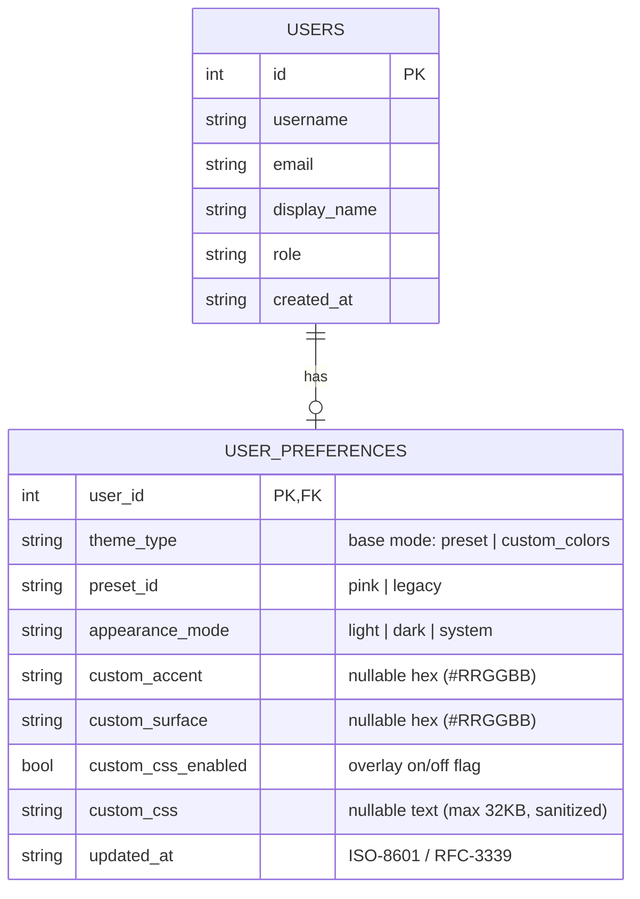

# Data Model: User Theme Customization

**Feature**: `016-user-theme-customization`  
**Date**: 2026-09-19 (revised 2026-09-21 after clarification session 2026-09-21)  
**Status**: Ready for Implementation  

---

## 1. Entities & Relationships



---

## 2. Entity Specifications

### 2.1 `UserPreference`

Represents an individual user's stored visual styling choices.

| Field | Type | Required | Default | Validation & Rules |
|---|---|---|---|---|
| `user_id` | `int64` | Yes | N/A | Primary Key; foreign key referencing `users(id)` with `ON DELETE CASCADE`. |
| `theme_type` | `string` | Yes | `'preset'` | Base mode enum: `'preset'`, `'custom_colors'`. Custom CSS is NOT a base mode — it is an overlay (see `custom_css_enabled`). |
| `preset_id` | `string` | Yes | `'pink'` | Enum: `'pink'`, `'legacy'`. Active preset when `theme_type == 'preset'`; retained as fallback otherwise. |
| `appearance_mode`| `string` | Yes | `'system'` | Enum: `'light'`, `'dark'`, `'system'`. Controls light/dark/system mode. |
| `custom_accent` | `string` | No | `null` | Hex color code (e.g. `'#3B82F6'`). Validated by regex `^#([0-9a-fA-F]{6})$`. Retained when switching back to a preset; nulled only by the reset action. |
| `custom_surface`| `string` | No | `null` | Hex color code (e.g. `'#18181B'`). Validated by regex `^#([0-9a-fA-F]{6})$`. Same retention rule as `custom_accent`. |
| `custom_css_enabled` | `bool` | Yes | `false` | Whether the custom CSS overlay is injected on top of the active base theme. Toggling it never deletes `custom_css`. |
| `custom_css` | `string` | No | `null` | Sanitized CSS text (see §5). Max length 32,768 characters (32 KB). Retained when the overlay is disabled; nulled only by the reset action. |
| `updated_at` | `string` | Yes | `datetime('now')` | RFC-3339 timestamp of last update. |

---

### 2.2 `ThemePreset`

A static, immutable preset definition bundled with the frontend application.

| Field | Type | Description |
|---|---|---|
| `id` | `ThemePresetId` | Unique preset identifier (`"pink"` or `"legacy"`). |
| `name` | `string` | User-facing display title (`"Modern Pink"` or `"Legacy Orange"`). |
| `description` | `string` | Brief explanation of the aesthetic. |
| `primaryAccent` | `string` | Characteristic accent hex color (`#FF4FA3` for Pink, `#F97316` for Legacy). |
| `surfaceDark` | `string` | Characteristic dark surface hex (`#1C1A20` for Pink, `#171717` for Legacy). |
| `surfaceLight` | `string` | Characteristic light surface hex (`#FFF7FB` for Pink, `#F8FAFC` for Legacy). |

---

### 2.3 `ClientThemeState`

The client-side in-memory and local cache representation.

```typescript
export type ThemeType = "preset" | "custom_colors";   // base mode only
export type ThemePresetId = "pink" | "legacy";
export type AppearanceMode = "light" | "dark" | "system";

export interface CustomColorConfig {
  accent: string;       // #RRGGBB
  surface: string;      // #RRGGBB
}

export interface UserThemePreferences {
  themeType: ThemeType;
  presetId: ThemePresetId;
  appearanceMode: AppearanceMode;
  customColors?: CustomColorConfig;
  customCssEnabled: boolean;   // overlay on/off; independent of themeType
  customCss?: string;          // retained even when customCssEnabled is false
  updatedAt?: string;
}
```

---

### 2.4 `ThemeExport`

A portable JSON document for manual transfer between Gameplane instances (FR-014). Full schema and rules in `contracts/theme-export.md`.

```typescript
export interface ThemeExport {
  format: "gameplane-theme";
  version: 1;
  preferences: UserThemePreferences;  // minus updatedAt
}
```

---

## 3. Database Schema & Migration

### Migration File: `api/internal/db/migrations/011_user_theme_preferences.sql`

(Migration `010` is already taken by `010_share_links_expiry_nullable.sql`.)

```sql
-- Create user_preferences table
CREATE TABLE user_preferences (
    user_id            INTEGER PRIMARY KEY REFERENCES users(id) ON DELETE CASCADE,
    theme_type         TEXT NOT NULL DEFAULT 'preset',
    preset_id          TEXT NOT NULL DEFAULT 'pink',
    appearance_mode    TEXT NOT NULL DEFAULT 'system',
    custom_accent      TEXT,
    custom_surface     TEXT,
    custom_css_enabled INTEGER NOT NULL DEFAULT 0,
    custom_css         TEXT,
    updated_at         TEXT NOT NULL DEFAULT (datetime('now'))
);

CREATE INDEX idx_user_preferences_user ON user_preferences(user_id);

-- Migration rule: Pre-existing accounts created before this migration
-- are explicitly initialized with the legacy orange & dark theme.
INSERT INTO user_preferences (user_id, theme_type, preset_id, appearance_mode)
SELECT id, 'preset', 'legacy', 'system'
FROM users;
```

---

## 4. State Transitions

```mermaid
stateDiagram-v2
    [*] --> Unauthenticated : Open App
    Unauthenticated --> PinkPresetDefault : Login or Public Share Link (always Pink, no custom CSS)
    
    Unauthenticated --> Authenticated : Sign in (optionally via "safe mode" login link)
    Authenticated --> FetchPreferences : Request /users/me
    
    state FetchPreferences {
        [*] --> CheckDB
        CheckDB --> ExistingUser : Row found (migrated or saved)
        CheckDB --> NewUser : No row found
        ExistingUser --> ApplySavedTheme : Apply base + overlay state
        NewUser --> ApplyDefaultPink : Apply Pink preset
    }

    ApplySavedTheme --> ActiveSession
    ApplyDefaultPink --> ActiveSession

    state ActiveSession {
        [*] --> Idle
        Idle --> SwitchPreset : User clicks Preset (Pink <-> Legacy)
        Idle --> UpdateColors : User adjusts Accent or Surface
        Idle --> ToggleOverlay : User enables/disables Custom CSS overlay
        Idle --> EditCustomCss : User saves Custom CSS (sanitized)
        Idle --> SafeModeTriggered : ?safe-mode=1, keyboard shortcut, or safe-mode login link
        Idle --> ResetTriggered : User confirms "Reset to Defaults"
        Idle --> ImportTheme : User imports Theme Export JSON
        
        SwitchPreset --> PersistUpdate : Base changes; customs retained; overlay styles still win on targeted elements
        UpdateColors --> PersistUpdate : Optimistic apply & PUT /users/me/preferences
        ToggleOverlay --> PersistUpdate : Mount/unmount <style>; stored CSS retained
        EditCustomCss --> PersistUpdate : Optimistic apply & PUT /users/me/preferences
        ImportTheme --> PersistUpdate : Client-validated; server sanitization authoritative
        
        PersistUpdate --> Idle : Success
        SafeModeTriggered --> Idle : Overlay suspended for session; stored CSS untouched; banner shown
        ResetTriggered --> Idle : POST /preferences/reset nulls customs; preset restored
    }
```



---

## 5. Validation Rules

1. **Authentication Gate**: Only authenticated users can read or write `user_preferences`.
2. **Preset Identifier Validation**: `presetId` must strictly equal `"pink"` or `"legacy"`.
3. **Theme Type Validation**: `themeType` must strictly equal `"preset"` or `"custom_colors"`.
4. **Appearance Mode Validation**: `appearanceMode` must strictly equal `"light"`, `"dark"`, or `"system"`.
5. **Color Format Validation**: Any provided `custom_accent` or `custom_surface` must be a valid 6-character hex color string starting with `#`.
6. **Custom CSS Sanitization (FR-013)** — all rejections return `400 Bad Request` with a message identifying the offending rule:
   - Maximum length: 32,768 characters (32 KB).
   - `@import` rules are rejected.
   - External `url()` references (absolute `http://`/`https://` or protocol-relative `//host/...`), including remote font loads, are rejected; inline `data:` URIs are permitted.
   - Syntax must be parseable (balanced braces, valid declarations).
   - Text containing `<style`, `</style`, `<script`, or `</script` is rejected (DOM-escape defense).
7. **Retention (FR-012)**: `PUT` requests that switch `preset_id`/`theme_type` or toggle `custom_css_enabled` MUST NOT null `custom_accent`, `custom_surface`, or `custom_css`. Only `POST /api/v1/users/me/preferences/reset` clears them.
8. **Import (FR-014)**: Imported theme documents are validated against the `ThemeExport` schema client-side; the server applies rules 1–7 on the resulting `PUT`, so import cannot bypass sanitization.
